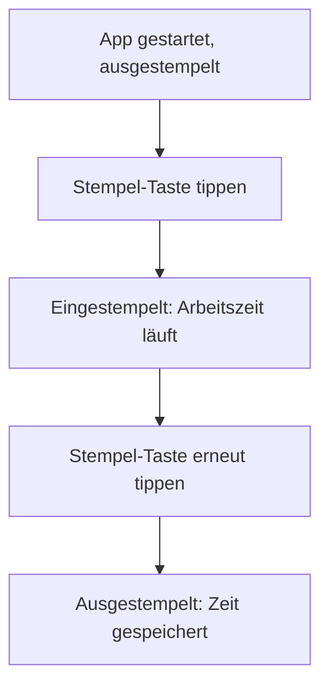

# Ein-/Ausstempeln & Zeitmessung

**ID:** FEAT-001
**Priorität:** High
**Status:** Draft
**Verantwortlicher:** flokau
**Erstellt am:** 2026-02-27
**Aktualisiert am:** 2026-02-27

---

## 📌 Zusammenfassung

Dieses Feature ermöglicht dem Benutzer, sich mit einem Tastendruck ein- und auszustempeln und die dazwischen verstrichene Arbeitszeit zu messen. Die laufende Arbeitszeit wird live auf dem Stempeluhr-Screen angezeigt.

---

## 🎯 Ziele

- Arbeitszeit mit einem Tastendruck erfassen (ein-/ausstempeln)
- Laufende Arbeitszeit live auf dem Stempeluhr-Screen anzeigen
- Stempelzeitpunkte lokal persistieren, sodass sie nach App-Neustart erhalten bleiben

---

## 🚫 Nicht-Ziele (Out of Scope)

- Keine Pausen-Erfassung in dieser Version
- Kein Export der Zeiten (separates Feature FEAT-003)
- Keine Backend-/Cloud-Synchronisation

---

## 📱 UI/UX-Anforderungen

### Mockups/Designs

- **Hauptbildschirme:**
  - Stempeluhr-Screen mit großer Stempel-Taste (`TrackTime`-Widget: Play-Icon grün = ausgestempelt, Pause-Icon = eingestempelt)
  - Anzeige der laufenden Arbeitszeit (HH:MM:SS)

### User Flows



---

## 🔧 Technische Anforderungen

### Frontend (Flutter)

- **Widgets:**
  - `TrackTime` (bestehend, erweitert): Play/Pause-Icon als Stempel-Taste
  - `StreamBuilder` mit `Stream.periodic` für die laufende Uhrzeit-Anzeige
- **State Management:**
  - `StatefulWidget` (`TrackTimeState`) mit Erweiterung um Stempel-Logik
- **Abhängigkeiten:**
  - `intl: ^0.19.0` für Zeitformatierung

### Backend / Persistenz

- **Speicher:**
  - Lokale JSON-Datei (z. B. `stempelzeiten.json`) via `path_provider`
- **Datenmodell:**

```dart
class Stempelzeit {
  final DateTime start;
  final DateTime? ende;
  Stempelzeit({required this.start, this.ende});

  Duration get dauer => ende?.difference(start) ?? Duration.zero;
}
```

---

## 📥 Eingaben

| Eingabe | Typ | Erforderlich | Validierung | Beispiel |
|---------|-----|--------------|-------------|----------|
| Stempel-Taste tippen | Tap-Event | Ja | Nur wenn App im Vordergrund | – |

---

## 📤 Ausgaben

| Fall | Ergebnis | Umsetzung |
|------|----------|-----------|
| Eingestempelt | Arbeitszeitmessung startet, Pause-Icon wird angezeigt | `Icon(Icons.pause_circle_outline)` + Timer |
| Ausgestempelt | Gemessene Zeit wird gespeichert, Play-Icon wird angezeigt | `Icon(Icons.play_circle_outline)` + Persistenz |
| Speicherfehler | Fehlermeldung | `SnackBar` mit Fehlertext |

---

## ⚠️ Fehlerbehandlung

| Fehlerfall | Ursache | Meldung | Behandlung |
|------------|---------|---------|-----------|
| Datei nicht schreibbar | Fehlende Berechtigungen / Speicher voll | "Stempelzeit konnte nicht gespeichert werden" | `SnackBar`, Zeit bleibt im Speicher, Retry beim nächsten Stempeln |
| App während laufender Messung beendet | Process-Tod | – | Offene Messung beim Start erkennen und als eingestempelt weiterführen |

---

## 🧪 Testfälle

### Unit Tests

```dart
test('Stempelzeit berechnet Dauer korrekt', () {
  final zeit = Stempelzeit(
    start: DateTime(2026, 2, 27, 8, 0),
    ende: DateTime(2026, 2, 27, 17, 0),
  );
  expect(zeit.dauer.inHours, 9);
});

test('Offene Stempelzeit hat Dauer null', () {
  final zeit = Stempelzeit(start: DateTime(2026, 2, 27, 8, 0));
  expect(zeit.dauer, Duration.zero);
});
```

### Widget Tests

```dart
testWidgets('Einstempeln wechselt Icon und startet Anzeige', (WidgetTester tester) async {
  await tester.pumpWidget(const MaterialApp(home: StempeluhrApp()));
  await tester.tap(find.byKey(const Key('stampButton')));
  await tester.pump();
  expect(find.byIcon(Icons.pause_circle_outline), findsOneWidget);
});
```

### Integration Tests

- TC-001: Ein-/Ausstempeln erzeugt eine Stempelzeit mit korrekter Dauer
- TC-002: App-Neustart bei laufender Messung stellt Zustand wieder her
- TC-003: Speicherfehler zeigt Fehlermeldung, ohne die Messung zu verlieren

---

## 📝 Szenarien (BDD-Style)

```gherkin
Feature: Ein-/Ausstempeln & Zeitmessung
  Scenario: Erfolgreiches Einstempeln
    Given der Benutzer ist ausgestempelt auf dem Stempeluhr-Screen
    When der Benutzer auf die Stempel-Taste tippt
    Then startet die Arbeitszeitmessung
    And das Pause-Icon wird angezeigt

  Scenario: Erfolgreiches Ausstempeln
    Given der Benutzer ist eingestempelt
    When der Benutzer auf die Stempel-Taste tippt
    Then wird die gemessene Zeit gespeichert
    And das Play-Icon wird angezeigt
```

---

## 🔗 Abhängigkeiten zu anderen Features

- FEAT-002 (Uhr): Anzeige der laufenden Zeit auf dem Hauptbildschirm
- FEAT-003 (Tagesbericht exportieren): nutzt die gespeicherten Stempelzeiten
- FEAT-004 (Countdown): nutzt die laufende Messung als Basis

---

## 📅 Meilensteine

| Meilenstein | Start | Ende | Status |
|-------------|-------|------|--------|
| Spezifikation | 2026-02-27 | 2026-03-02 | ⏳ In Arbeit |
| UI-Implementierung | – | – | ⬜ Nicht gestartet |
| Persistenz-Integration | – | – | ⬜ Nicht gestartet |
| Testing | – | – | ⬜ Nicht gestartet |

---

## 📎 Anhänge

- [README – Intended features](../../README.md)

---

## 💬 Offene Fragen

- Soll eine offene Messung nach einem App-Absturz automatisch geschlossen oder manuell bestätigt werden?
- Sollen mehrere Stempelperioden pro Tag erlaubt sein (z. B. für Unterbrechungen)?

---

## ✅ Akzeptanzkriterien

- Der Benutzer kann sich mit einem Tastendruck ein- und ausstempeln.
- Die laufende Arbeitszeit wird live (HH:MM:SS) angezeigt.
- Stempelzeiten werden lokal persistiert und überstehen einen App-Neustart.
- Bei Speicherfehlern erscheint eine klare Fehlermeldung, ohne Datenverlust.
- Alle Testfälle sind erfolgreich.
