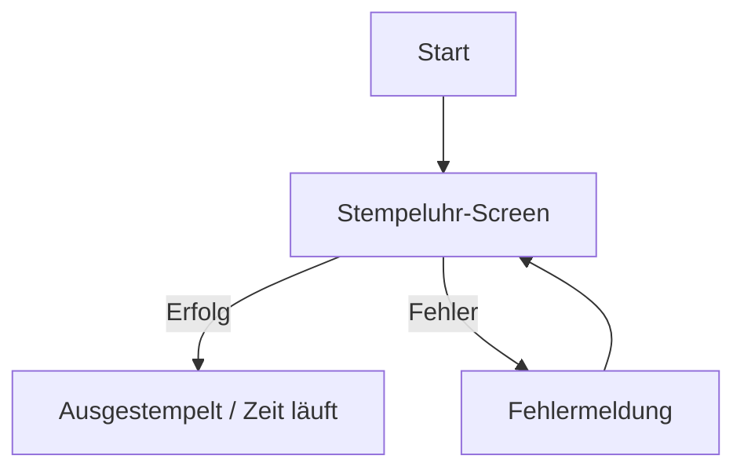

# [Feature-Name]

**ID:** [z. B. FEAT-001]
**Priorität:** [High/Medium/Low]
**Status:** [Draft/In Review/Approved/Implemented/Tested]
**Verantwortlicher:** [Name]
**Erstellt am:** [Datum]
**Aktualisiert am:** [Datum]

---

## 📌 Zusammenfassung

[Kurze Beschreibung des Features in 1–2 Sätzen.
Beispiel: *"Dieses Feature ermöglicht Benutzern, sich ein- und auszustempeln und die dazwischen verstrichene Arbeitszeit zu messen."*]

---

## 🎯 Ziele

- [Ziel 1: z. B. "Arbeitszeit mit einem Tastendruck erfassen"]
- [Ziel 2: z. B. "Laufende Arbeitszeit live auf dem Stempeluhr-Screen anzeigen"]
- [Ziel 3]

---

## 🚫 Nicht-Ziele (Out of Scope)

- [Was *nicht* Teil dieses Features ist.
  Beispiel: *"Keine Pausen-Erfassung in dieser Version."*]

---

## 📱 UI/UX-Anforderungen

### Mockups/Designs

- [Link zu Figma/Adobe XD oder angehängte Bilder]
- **Hauptbildschirme:**
  - [Bildschirm 1: z. B. "Stempeluhr-Screen mit großer Play/Pause-Taste"]
  - [Bildschirm 2]

### User Flows



---

## 🔧 Technische Anforderungen

### Frontend (Flutter)

- **Widgets:**
  - [Widget 1: z. B. `Icon` mit `Icons.play_circle_outline` für Einstempeln]
  - [Widget 2: z. B. `StreamBuilder` für die laufende Uhrzeit]
- **State Management:**
  - [z. B. `StatefulWidget`, `Provider`, `Riverpod`, `Bloc`]
- **Abhängigkeiten:**
  - [z. B. `intl: ^0.19.0` für Datumsformatierung]
  - [z. B. `shared_preferences` für lokale Speicherung]

### Backend / Persistenz (falls zutreffend)

- **Speicher:**
  - [z. B. lokale JSON-Datei, `shared_preferences`, SQLite]
- **Datenmodelle:**

```dart
class Arbeitstag {
  final DateTime start;
  DateTime? ende;
  Arbeitstag({required this.start, this.ende});
}
```

---

## 📥 Eingaben

| Eingabe | Typ | Erforderlich | Validierung | Beispiel |
|---------|-----|--------------|-------------|----------|
| [Eingabe 1: z. B. E-Mail] | [String] | [Ja] | [RFC 5322-konform] | `user@example.com` |
| [Eingabe 2: z. B. Passwort] | [String] | [Ja] | [Mind. 8 Zeichen] | `Secure123` |

---

## 📤 Ausgaben

| Fall | Ergebnis | Umsetzung |
|------|----------|-----------|
| [Erfolgsfall: z. B. Erfolgreich eingestempelt] | [Zeitmessung startet] | [`TrackTime`-Widget zeigt Pause-Icon] |
| [Fehlerfall 1] | [Fehlermeldung: "…"] | [`SnackBar` mit Fehlertext] |
| [Fehlerfall 2: z. B. Netzwerkfehler] | [Fehlermeldung: "Keine Internetverbindung"] | [`AlertDialog`] |

---

## ⚠️ Fehlerbehandlung

| Fehlerfall | Ursache | Meldung | Behandlung |
|------------|---------|---------|-----------|
| [Leeres Feld] | [Benutzer lässt Feld leer] | ["Bitte … eingeben"] | [Validierung vor Verarbeitung] |
| [Falsche Eingabe] | [Wert stimmt nicht] | ["Ungültige Eingabe"] | [Anzeige und erneute Eingabe] |
| [Speicherfehler] | [z. B. Datei nicht schreibbar] | ["Daten konnten nicht gespeichert werden"] | [Retry / Fallback] |

---

## 🧪 Testfälle

### Unit Tests

```dart
// Beispiel: Test für Validierung
test('Validierung akzeptiert gültigen Wert', () {
  final validator = MeinValidator();
  expect(validator.validate('gueltig'), true);
});
```

### Widget Tests

```dart
// Beispiel: Test für Stempel-Button
testWidgets('Einstempeln startet Zeitmessung', (WidgetTester tester) async {
  await tester.pumpWidget(const MaterialApp(home: StempeluhrScreen()));
  await tester.tap(find.byKey(const Key('stampButton')));
  await tester.pump();
  expect(find.byIcon(Icons.pause_circle_outline), findsOneWidget);
});
```

### Integration Tests

- [TC-001: Erfolgreicher Ablauf]
- [TC-002: Fehlerfall bei ungültiger Eingabe]
- [TC-003: Fehlerbehandlung bei Speicherfehler]

---

## 📝 Szenarien (BDD-Style)

```gherkin
Feature: [Feature-Name]
  Scenario: Erfolgreicher Ablauf
    Given der Benutzer ist auf dem [Screen]
    When der Benutzer [Aktion ausführt]
    Then [erwartetes Ergebnis]

  Scenario: Fehlerfall
    Given der Benutzer ist auf dem [Screen]
    When der Benutzer [ungültige Aktion ausführt]
    Then sieht der Benutzer die Fehlermeldung "[Meldung]"
```

---

## 🔗 Abhängigkeiten zu anderen Features

- [Feature A: z. B. "FEAT-001" (muss vorher implementiert sein)]
- [Feature B]

---

## 📅 Meilensteine

| Meilenstein | Start | Ende | Status |
|-------------|-------|------|--------|
| Spezifikation | [Datum] | [Datum] | ⬜ Nicht gestartet |
| UI-Implementierung | [Datum] | [Datum] | ⬜ Nicht gestartet |
| Persistenz-Integration | [Datum] | [Datum] | ⬜ Nicht gestartet |
| Testing | [Datum] | [Datum] | ⬜ Nicht gestartet |

---

## 📎 Anhänge

- [Link zu Figma-Design]
- [Link zu API-Dokumentation]
- [Link zu technischen Entscheidungen (ADRs)]

---

## 💬 Offene Fragen

- [Frage 1: z. B. "Sollen Pausen automatisch erkannt werden?"]
- [Frage 2]

---

## ✅ Akzeptanzkriterien

- [Kriterium 1]
- [Kriterium 2]
- [Das Feature funktioniert offline]
- [Alle Testfälle sind erfolgreich]
